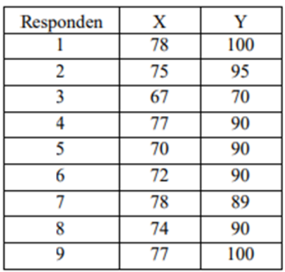
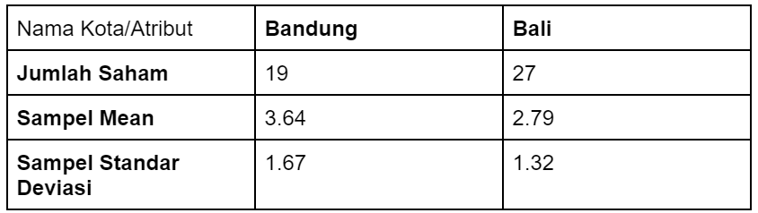
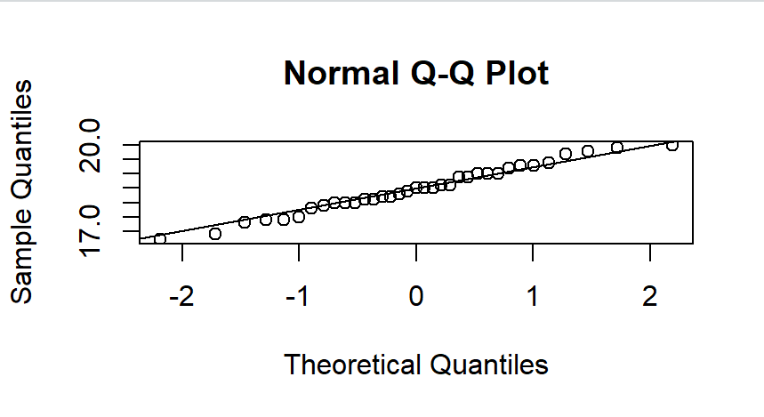
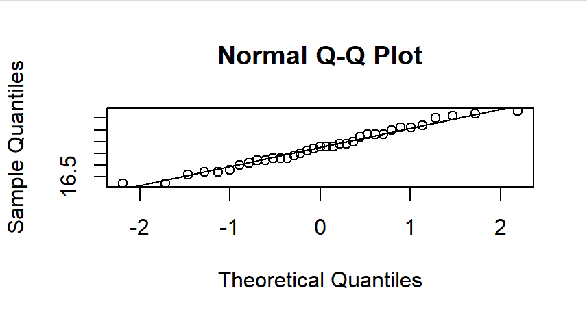
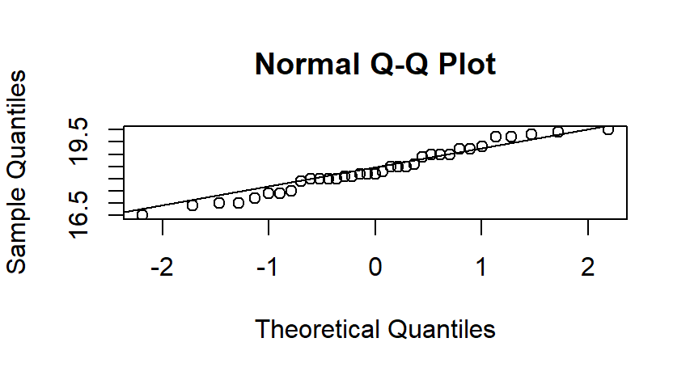
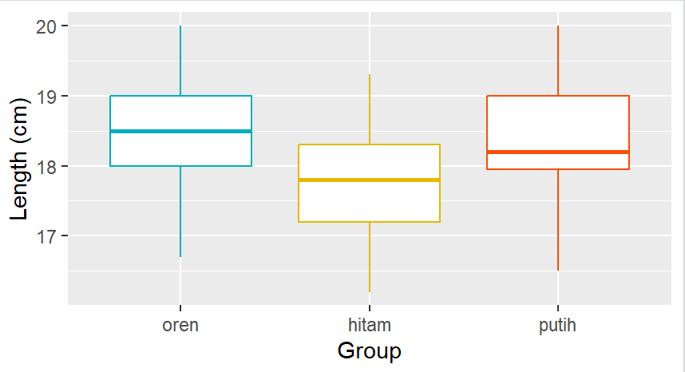
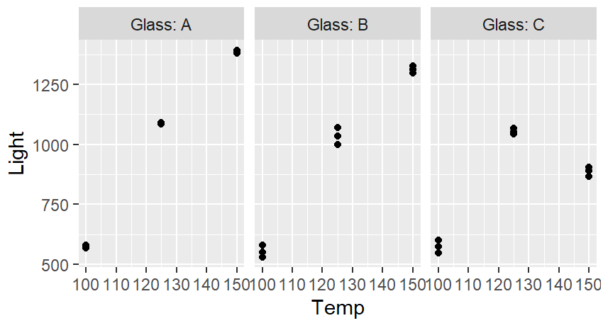

# Modul2_Probstat_5025211154

## Nomor 1
>Seorang peneliti melakukan penelitian mengenai pengaruh aktivitas 𝐴 terhadap kadar saturasi oksigen pada manusia. Peneliti tersebut mengambil sampel sebanyak 9 responden. Pertama, sebelum melakukan aktivitas 𝐴, peneliti mencatat kadar saturasi oksigen dari 9 responden tersebut. Kemudian, 9 responden tersebut diminta melakukan aktivitas 𝐴. Setelah 15 menit, peneliti tersebut mencatat kembali kadar saturasi oksigen dari 9 responden tersebut. Berikut data dari 9 responden mengenai kadar saturasi oksigen sebelum dan sesudah melakukan aktivitas 𝐴\
\
>Berdasarkan data pada tabel diatas, diketahui kadar saturasi oksigen  dari responden ke-3 ketika belum melakukan aktivitas 𝐴 sebanyak 67, dan setelah melakukan aktivitas 𝐴 sebanyak 70.
- Carilah Standar Deviasi dari data selisih pasangan pengamatan tabel diatas\
Pertama, saya menggunakan variabel x dan y untuk menyimpan semua data kadar saturasi oksigen sebelum dan sesudah melakukan aktivitas. Selanjutnya, selisih kedua data tersebut saya masukkan ke dalam variabel d. Standar deviasi kemudian dicari menggunakan fungsi sd pada bahasa r menggunakan code sebagai berikut:
    ```R
    x <- c(78,75,67,77,70,72,78,74,77)
    y <- c(100,95,70,90,90,90,89,90,100)
    d <- y-x
    sd <- sd(d)
    print(sd)
    ```
    Dengan implementasi kode tersebut, didapatkan standar deviasi sebesar:
    '''R
    > print(sd)
    [1] 6.359595
    '''
- carilah nilai t (p-value)\
Nilai t bisa didapatkan dengan menggunakan fungsi t.test. Karena uji hipotesis yang dilakukan bersifat two tail dan menggunakan 2 populasi berpasangan, maka saya menggunakan alternative = two.sided dan paired=TRUE seperti berikut:
    ```R
    t.test(y,x,alternative="two.sided",paired=TRUE)$p.value
    ```
    Dengan langkah tersebut, didapatkan Nilai t:
    ```R
    > t.test(y,x,alternative="two.sided",paired=TRUE)$p.value
    [1] 6.003179e-05
    ```
- tentukanlah apakah terdapat pengaruh yang signifikan secara statistika dalam hal kadar saturasi oksigen , sebelum dan sesudah melakukan aktivitas 𝐴 jika diketahui tingkat signifikansi 𝛼 = 5% serta H0 : “tidak ada pengaruh yang signifikan secara statistika dalam hal kadar saturasi oksigen , sebelum dan sesudah melakukan aktivitas 𝐴”\
Karena p-value yang didapat (0,00006003179) lebih kecil dari nilai siginifikansi, maka H0 ditolak. Oleh karena itu dapat dikatakan bahwa terdapat pengaruh signifikan secara statistik dalam hal kadar saturasi oksigen.

## Nomor 2
>Diketahui bahwa mobil dikemudikan rata-rata lebih dari 20.000 kilometer per tahun. Untuk menguji klaim ini, 100 pemilik mobil yang dipilih secara acak diminta untuk mencatat jarak yang mereka tempuh. Jika sampel acak menunjukkan rata-rata 23.500 kilometer dan standar deviasi 3900 kilometer.
- Apakah Anda setuju dengan klaim tersebut?\
Ya, saya setuju
- Jelaskan maksud dari output yang dihasilkan! \
    ```R
    miu <- 20000
    x <- 23500
    s <- 3900
    n <- 100
    library(BSDA)
    tsum.test(mean.x=x,s.x=s,n.x=n,mu=miu,alternative = "greater")
    qnorm(p=0.05,mean=0,sd=1,lower.tail = FALSE)
    ```
    Code tersebut menghasilkan output:
    ```R
    > tsum.test(mean.x=x,s.x=s,n.x=n,mu=miu,alternative = "greater")

    	One-sample t-Test
    
    data:  Summarized x
    t = 8.9744, df = 99, p-value = 9.437e-15
    alternative hypothesis: true mean is greater than 20000
    95 percent confidence interval:
     22852.45       NA
    sample estimates:
    mean of x 
        23500
    > qnorm(p=0.05,mean=0,sd=1,lower.tail = FALSE)
    [1] 1.644854
    ```
Output tersebut menunjukkan bahwa nilai statistik uji t = 8,9744 dan p-value = 9.437e-15. Selain itu, didapatkan pula nilai kritis sebesar 1,644854 yang berarti bahwa H0 ditolak jika uji statistik t>1,644854 dan diterima jika t<=1,644854.
- Buatlah kesimpulan berdasarkan P-Value yang dihasilkan!\
Pada output, dapat dilihat bahwa p-value yang dihasilkan berada di bawah siginificance level 𝛼=0.05 sehingga dapat diputuskan bahwa H0 ditolak. Dengan begitu, dapat disimpulkan bahwa mobil dikemudikan rata-rata lebih dari 20.000 kilometer per tahun.

## Nomor 3
>Diketahui perusahaan memiliki seorang data analyst ingin memecahkan permasalahan pengambilan keputusan dalam perusahaan tersebut. Selanjutnya didapatkanlah data berikut dari perusahaan saham tersebut.\
\
>Dari data diatas berilah keputusan serta kesimpulan yang didapatkan dari hasil diatas. Asumsikan nilai variancenya sama, apakah ada perbedaan pada rata-ratanya (α= 0.05)? Buatlah :
- H0 dan H1\
H0 : μ Bandung - μ Bali = 0\
H1 : μ Bandung - μ Bali ≠ 0
- Hitung Sampel Statistik\
Uji hipotesis miu pada 2 populasi dengan varian tidak diketahui menggunakan uji statistik t. Sehingga sampel statistik dapat dihitung menggunakan fungsi tsum.test
    ```R
    tsum.test(mean.x=3.64,s.x=1.67,n.x=19,mean.y=2.79,s.y=1.32,n.y=27,alternative="two.sided",var.equal=TRUE,conf.level = 0.95)
    ```
Maka, didapat sampel statistik
    ```R
    > tsum.test(mean.x=3.64,s.x=1.67,n.x=19,mean.y=2.79,s.y=1.32,n.y=27,alternative="two.sided",var.equal=TRUE,conf.level = 0.95)

	    Standard Two-Sample t-Test

    data:  Summarized x and y
    t = 1.9267, df = 44, p-value = 0.06049
    alternative hypothesis: true difference in means is not equal to 0
    95 percent confidence interval:
     -0.03911054  1.73911054
    sample estimates:
    mean of x mean of y 
         3.64      2.79

    ```
- Lakukan Uji Statistik (df =2)\

- Nilai Kritikal\
Uji hipotesis bersifat two tail sehingga digunakan siginificance level 𝛼/2 = 0.025
    ```R
    qt(p=0.025,df=44,lower.tail = TRUE)
    qt(p=0.025,df=44,lower.tail = FALSE)
    ```
Maka, didapat nilai kritikal
    ```R
    > qt(p=0.025,df=44,lower.tail = TRUE)
    [1] -2.015368
    > qt(p=0.025,df=44,lower.tail = FALSE)
    [1] 2.015368
    ```
- Keputusan\
Nilai statistik uji t berada di antara dua nilai kritikal sehingga H0 diterima.
- Kesimpulan\
Tidak terdapat cukup bukti untuk menolak H0 dan rata-rata saham di bandung sama dengan rata-rata saham di bali.

## Nomor 4
>Seorang Peneliti sedang meneliti spesies dari kucing di ITS . Dalam penelitiannya ia mengumpulkan data  tiga spesies kucing yaitu kucing oren, kucing hitam dan kucing putih dengan panjangnya masing-masing.\H0 : Tidak ada perbedaan panjang antara ketiga spesies atau rata-rata panjangnya sama
- Buatlah masing masing jenis spesies menjadi  3 subjek "Grup" (grup 1,grup 2,grup 3). Lalu Gambarkan plot kuantil normal untuk setiap kelompok dan lihat apakah ada outlier utama dalam homogenitas varians.
    ```R
    Kucing <- read.table("D:\\DataKucing.txt",header=TRUE)

    Kucing$Group <- as.factor(Kucing$Group)
    Kucing$Group <- factor(Kucing$Group, labels=c("oren","hitam","putih"))

    Group1 <- subset(Kucing, Group=="oren")
    Group2 <- subset(Kucing, Group=="hitam")
    Group3 <- subset(Kucing, Group=="putih")
    ```
    Group1
    ```R
    qqnorm(Group1$Length)
    qqline(Group1$Length)
    ```
    \
    Group2
    ```R
    qqnorm(Group2$Length)
    qqline(Group2$Length)
    ```
    \
    Group 3
    ```R
    qqnorm(Group3$Length)
    qqline(Group3$Length)
    ```
    
- carilah atau periksalah Homogeneity of variances nya , Berapa nilai p yang didapatkan? , Apa hipotesis dan kesimpulan yang dapat diambil ?\
Homogenity of variances dapat dicari menggunakan fungsi bartlett.test() seperti:
    ```R
    bartlett.test(Length~Group, data = Kucing)
    ```
    Menghasilkan P value:
    
    ```R
    > bartlett.test(Length~Group, data = Kucing)

		Bartlett test of homogeneity of variances

	data:  Length by Group
	Bartlett's K-squared = 0.43292, df = 2, p-value =
	0.8054
    ```
    
- Untuk uji ANOVA, buatlah model linier dengan Panjang versus Grup dan beri nama model tersebut model 1.\
    ```R
    model1 = lm(Length~Group, data = Kucing)
    anova(model1)
    ```
    Menghasilkan model linier:
    ```R
    > model1 = lm(Length~Group, data = Kucing)
    > anova(model1)
    Analysis of Variance Table

    Response: Length
               Df Sum Sq Mean Sq F value Pr(>F)   
    Group       2 10.615  5.3074  7.0982 0.0013 **
    Residuals 102 76.267  0.7477                  
    ---
    Signif. codes:  
    0 ‘***’ 0.001 ‘**’ 0.01 ‘*’ 0.05 ‘.’ 0.1 ‘ ’ 1
    ```
- Dari Hasil Poin C , Berapakah nilai-p ? ,  Apa yang dapat Anda simpulkan dari H0?\
Nilai-p adalah 0,0013 (<0,05) sehingga dapat disimpulkan bahwa setidaknya terdapat 1 pasang populasi yang memiliki rata-rata panjang berbeda.
- Verifikasilah jawaban model 1 dengan Post-hooc test TukeyHSD ,  dari nilai p yang didapatkan apakah satu jenis kucing lebih panjang dari yang lain? Jelaskan.\
    ```R
    TukeyHSD(aov(model1))
    ```
    Menghasilkan:
    ```R
    > TukeyHSD(aov(model1))
      Tukey multiple comparisons of means
        95% family-wise confidence level

    Fit: aov(formula = model1)

    $Group
                      diff        lwr        upr     p adj
    hitam-oren  -0.7200000 -1.2116284 -0.2283716 0.0020955
    putih-oren  -0.1028571 -0.5944855  0.3887713 0.8726158
    putih-hitam  0.6171429  0.1255145  1.1087713 0.0098353
    ```
Hasil tersebut memperlihatkan nilai-p dari tiap pasang kucing. Untuk pasang kucing dengan p<0,05 memiliki rata-rata panjang berbeda sendang p>=0,05 memiliki rata-rata panjang sama. Dari tabel di atas dapat disimpulkan pasang kucing dengan rata-rata panjang sama adalah kucing putih dan oren.
- Visualisasikan data dengan ggplot2\
    ```R
    ggplot(Kucing, aes(x = Group, y = Length)) +
    geom_boxplot(color = c("#00AFBB", "#E7B800", "#FC4E07")) +
    scale_x_discrete() + xlab("Group") + ylab("Length (cm)")
    ```
    \

## Nomor 5
>Data yang digunakan merupakan hasil eksperimen yang dilakukan untuk mengetahui pengaruh suhu operasi (100˚C, 125˚C dan 150˚C) dan tiga jenis kaca pelat muka (A, B dan C) pada keluaran cahaya tabung osiloskop. Percobaan dilakukan sebanyak 27 kali 
- Buatlah plot sederhana untuk visualisasi data\
    ```R
    qplot(x = Temp, y = Light, geom = "point", data = GTL) + facet_grid(.~Glass, labeller = label_both)
    ```
    \
- Lakukan uji ANOVA dua arah untuk 2 faktor\
Pertama, buat variabel untuk menyimpan data glass dan temp
    ```R
    GTL$Glass <- as.factor(GTL$Glass)
    GTL$Temp <- as.factor(GTL$Temp)
    str(GTL)
    ```
Selanjutnya, anova dapat dilakukan dengan menggunakan fungsi aov()
    ```R
    anova <- aov(Light ~ Glass*Temp, data = GTL)
    summary(anova)
    ```
Maka, didapat hasil uji anova:
    ```R
    > summary(anova)
                Df  Sum Sq Mean Sq F value   Pr(>F)    
    Glass        2  150865   75432   206.4 3.89e-13 ***
    Temp         2 1970335  985167  2695.3  < 2e-16 ***
    Glass:Temp   4  290552   72638   198.7 1.25e-14 ***
    Residuals   18    6579     366                     
    ---
    Signif. codes:  
    0 ‘***’ 0.001 ‘**’ 0.01 ‘*’ 0.05 ‘.’ 0.1 ‘ ’ 1
    ```
- Tampilkan tabel dengan mean dan standar deviasi keluaran cahaya untuk setiap perlakuan (kombinasi kaca pelat muka dan suhu operasi)\
Untuk mencari nilai rataan dan varian distribusi exponensial, saya pertama mengenerate data random sebanyak 100 dengan menggunakan fungsi rexp() dan dimasukkan ke dalam variabel set. Setelah itu, rataan dan varian dicari dengan menggunakan fungsi mean(set) dan var(set).
    ```R
    data_summary <- group_by(GTL, Glass, Temp) %>%
      summarise(mean = mean(Light), sd = sd(Light)) %>%
      arrange(desc(mean))
    print(data_summary)
    ```
Maka, didapat tabel seperti berikut:
    ```R
    # A tibble: 9 × 4
    # Groups:   Glass [3]
      Glass Temp   mean    sd
      <fct> <fct> <dbl> <dbl>
    1 A     150   1386   6   
    2 B     150   1313  14.5 
    3 A     125   1087.  2.52
    4 C     125   1055. 10.6 
    5 B     125   1035  35   
    6 C     150    887. 18.6 
    7 C     100    573. 26.5 
    8 A     100    573.  6.43
    9 B     100    553  24.6
    ```
- Lakukan uji Tukey\
Uji Tukey dilakukan dengan fungsi berikut:
    ```R
    tukey <- TukeyHSD(anova)
    print(tukey)
    ```
Maka, didapat hasil:
    ```R
    > print(tukey)
      Tukey multiple comparisons of means
        95% family-wise confidence level

    Fit: aov(formula = Light ~ Glass * Temp, data = GTL)

    $Glass
              diff        lwr       upr     p adj
    B-A  -48.33333  -71.33487  -25.3318 0.0001206
    C-A -177.11111 -200.11265 -154.1096 0.0000000
    C-B -128.77778 -151.77932 -105.7762 0.0000000

    $Temp
                diff      lwr      upr p adj
    125-100 492.6667 469.6651 515.6682     0
    150-100 628.8889 605.8874 651.8904     0
    150-125 136.2222 113.2207 159.2238     0
  
    $`Glass:Temp`
                        diff        lwr         upr
    B:100-A:100  -19.6666667  -74.36273   35.029396
    C:100-A:100    0.6666667  -54.02940   55.362729
    A:125-A:100  514.6666667  459.97060  569.362729
    B:125-A:100  462.3333333  407.63727  517.029396
    C:125-A:100  482.0000000  427.30394  536.696063
    A:150-A:100  813.3333333  758.63727  868.029396
    B:150-A:100  740.3333333  685.63727  795.029396
    C:150-A:100  314.0000000  259.30394  368.696063
    C:100-B:100   20.3333333  -34.36273   75.029396
    A:125-B:100  534.3333333  479.63727  589.029396
    B:125-B:100  482.0000000  427.30394  536.696063
    C:125-B:100  501.6666667  446.97060  556.362729
    A:150-B:100  833.0000000  778.30394  887.696063
    B:150-B:100  760.0000000  705.30394  814.696063
    C:150-B:100  333.6666667  278.97060  388.362729
    A:125-C:100  514.0000000  459.30394  568.696063
    B:125-C:100  461.6666667  406.97060  516.362729
    C:125-C:100  481.3333333  426.63727  536.029396
    A:150-C:100  812.6666667  757.97060  867.362729
    B:150-C:100  739.6666667  684.97060  794.362729
    C:150-C:100  313.3333333  258.63727  368.029396
    B:125-A:125  -52.3333333 -107.02940    2.362729
    C:125-A:125  -32.6666667  -87.36273   22.029396
    A:150-A:125  298.6666667  243.97060  353.362729
    B:150-A:125  225.6666667  170.97060  280.362729
    C:150-A:125 -200.6666667 -255.36273 -145.970604
    C:125-B:125   19.6666667  -35.02940   74.362729
    A:150-B:125  351.0000000  296.30394  405.696063
    B:150-B:125  278.0000000  223.30394  332.696063
    C:150-B:125 -148.3333333 -203.02940  -93.637271
    A:150-C:125  331.3333333  276.63727  386.029396
    B:150-C:125  258.3333333  203.63727  313.029396
    C:150-C:125 -168.0000000 -222.69606 -113.303937
    B:150-A:150  -73.0000000 -127.69606  -18.303937
    C:150-A:150 -499.3333333 -554.02940 -444.637271
    C:150-B:150 -426.3333333 -481.02940 -371.637271
                    p adj
    B:100-A:100 0.9307049
    C:100-A:100 1.0000000
    A:125-A:100 0.0000000
    B:125-A:100 0.0000000
    C:125-A:100 0.0000000
    A:150-A:100 0.0000000
    B:150-A:100 0.0000000
    C:150-A:100 0.0000000
    C:100-B:100 0.9179607
    A:125-B:100 0.0000000
    B:125-B:100 0.0000000
    C:125-B:100 0.0000000
    A:150-B:100 0.0000000
    B:150-B:100 0.0000000
    C:150-B:100 0.0000000
    A:125-C:100 0.0000000
    B:125-C:100 0.0000000
    C:125-C:100 0.0000000
    A:150-C:100 0.0000000
    B:150-C:100 0.0000000
    C:150-C:100 0.0000000
    B:125-A:125 0.0670029
    C:125-A:125 0.5065610
    A:150-A:125 0.0000000
    B:150-A:125 0.0000000
    C:150-A:125 0.0000000
    C:125-B:125 0.9307049
    A:150-B:125 0.0000000
    B:150-B:125 0.0000000
    C:150-B:125 0.0000006
    A:150-C:125 0.0000000
    B:150-C:125 0.0000000
    C:150-C:125 0.0000001
    B:150-A:150 0.0045830
    C:150-A:150 0.0000000
    C:150-B:150 0.0000000
    ```
- Gunakan compact letter display untuk menunjukkan perbedaan signifikan antara uji Anova dan uji Tukey\
Pertama, dibuat compact display dengan fungsi berikut:
    ```R
    tukey.cld <- multcompLetters4(anova, tukey)
    print(tukey.cld)
    ```
Sehingga dihasilkan
    ```R
    > print(tukey.cld)
    $Glass
      A   B   C 
    "a" "b" "c" 

    $Temp
    150 125 100 
    "a" "b" "c" 

    $`Glass:Temp`
    A:150 B:150 A:125 C:125 B:125 C:150 C:100 A:100 B:100 
      "a"   "b"   "c"   "c"   "c"   "d"   "e"   "e"   "e" 
    ```
Kemudian, cld dimasukkan ke dalam tabel yang telah dibuat pada soal 5c
    ```R
    cld <- as.data.frame.list(tukey.cld$`Glass:Temp_Factor`)
    data_summary$Tukey <- cld$Letters
    print(data_summary)
    ```
    ```R
    > print(data_summary)
      Glass Temp      mean        sd
    1     A  150 1386.0000  6.000000
    2     B  150 1313.0000 14.525839
    3     A  125 1087.3333  2.516611
    4     C  125 1054.6667 10.598742
    5     B  125 1035.0000 35.000000
    6     C  150  886.6667 18.610033
    7     C  100  573.3333 26.539279
    8     A  100  572.6667  6.429101
    9     B  100  553.0000 24.637370

    ```
